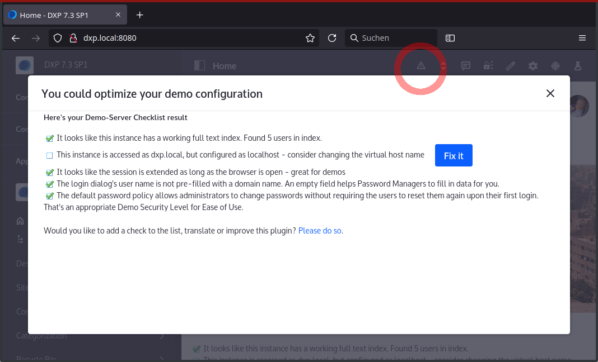

# Demo Checklist

When sharing demo setups (specifically as a Liferay Sales Engineer, working on DXP-Cloud), there are a couple of steps to be taken manually, as their inclusion in each and every setup requires additional manual steps, to prepare any image that's to be shared.

To ease the sharing of demos, here's a quick checklist. It's implemented as Widget, but there's no need to drop it to any page: If this plugin is deployed and at least one point on the checklist is open, a "warning sign" will display in the ControlMenu, opening the widget in a popup dialog. 

If you have your own policy or an extended checklist, and would like to contribute: Go ahead: This plugin is meant to share Best Practices, and soft-enforce them by pointing them out.

 

## Build-instructions

This plugin has been built within a Liferay Workspace, configured for Target Platform 7.3.10 but only tested on DXP 7.3 SP1