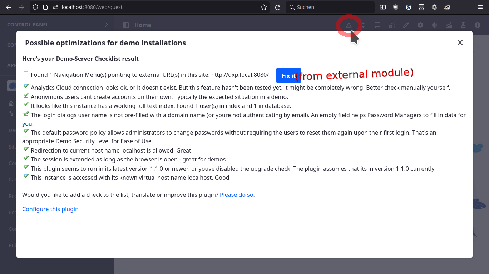

# Demo Checklist

When sharing demo setups (specifically as a Liferay Sales Engineer, working on DXP-Cloud), there are a couple of steps to be taken manually, as their inclusion in each and every setup requires additional manual steps, to prepare any image that's to be shared.

To ease the sharing of demos, here's a quick checklist. It's implemented as Widget, but there's no need to drop it to any page: If this plugin is deployed and at least one point on the checklist is open, a "warning sign" will display in the ControlMenu, opening the widget in a popup dialog. From Version 1.0.4 on you can configured it to always show an info - either the warning sign or a checkmark (System Settings / Third Party / Configuration Checklist) 

If you have your own policy or an extended checklist, and would like to contribute: Go ahead: This plugin is meant to share Best Practices, and soft-enforce them by pointing them out. You'll just need to implement a simple service - the current ones are all available in the package com.liferay.sales.checklist.impl

 

## What's being checked

* (currently defunct): Analytics Cloud connection
* Can strangers create their own accounts? (target: no)
* Is the full-text index up to date? (target: yes)
* Is the login name pre-populated with an email domain, so that it effectively disables password managers? (target: no)
* Does the system require users to change their password after an administrator has set them? (target: no)
* Is the session extended for as long as a browser is open? (target: yes)
* Is this plugin up to date? (can be configured - target: yes)
* Does the virtual host that is used to access the system match the configured one? (target: yes)

## Available translations

* english
* german
* spanish

## Build-instructions

This plugin has been built within a Liferay Workspace, configured for Target Platform 7.3.10 but is only tested on DXP 7.3 SP1, or maybe later.